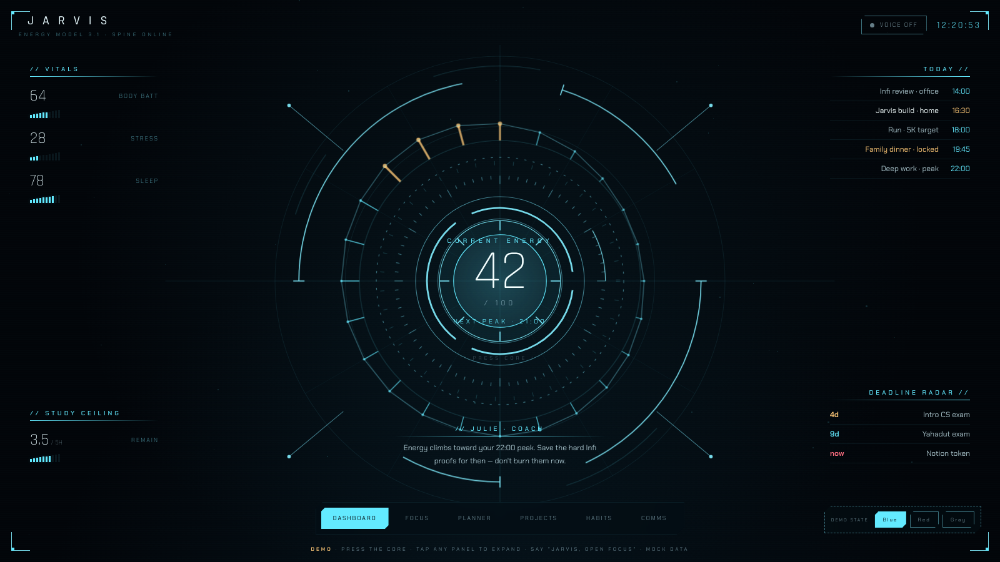

# J.A.R.V.I.S.

A personal life-ops HUD, built as a Tauri desktop app (Rust + TypeScript)
around a single local SQLite database. It tracks energy/recovery data,
deadlines, a daily plan, and habits, and renders them into a heads-up
dashboard styled after a fictional AI assistant.

**Live HUD demo:** https://zoharishere.github.io/jarvis/



The demo above is `hud/index.html` running standalone against mock data.
The Tauri desktop app now loads this same file directly (see [Known
limitations](#known-limitations--in-progress) for what's still mock vs.
live).

## Architecture: the spine

Everything in this project is organized around one idea: **subsystems
never talk to each other directly.** Instead, every collector, planner,
and UI panel reads and writes a single SQLite database — the "spine"
(`jarvis.db`) — and nothing else.

```
Garmin collector ─┐
(external script)  │
                    ├──▶  jarvis.db (spine)  ◀──▶  Tauri app / HUD
Future collectors ─┘         (SQLite)
(calendar, phone usage, …)
```

Concretely:

- The schema lives in [`src-tauri/migrations/`](src-tauri/migrations)
  and is applied by the `tauri-plugin-sql` migration runner in
  [`src-tauri/src/lib.rs`](src-tauri/src/lib.rs) — but only once
  something on the frontend actually opens the database via the plugin's
  JS API. `hud/index.html` doesn't do that yet (it's still mock data
  throughout), so in practice migrations only run when a frontend build
  that calls `Database.load()` is in place.
- Tables include `energy_state` / `energy_forecast` / `energy_log` (body
  battery, sleep, stress, and a rule-based hourly energy curve),
  `deadlines` and `tasks` (the planner's input pool), `plan_blocks`
  (today's schedule), `interventions` (anti-burnout history),
  `checkins`, `app_usage`, `settings` (tunable thresholds instead of
  hardcoded constants), and `habits` / `habit_log` (habit definitions and
  daily check-ins — streaks are computed from the log, not stored).
- [`garmin_collector.py`](garmin_collector.py) is a standalone Python
  script, run on a schedule (e.g. via `launchd`), that pulls body
  battery / stress / sleep from Garmin Connect, computes a rule-based
  24-hour energy forecast, and writes the result straight into the
  spine. **The Tauri app never talks to Garmin, and the collector never
  talks to the app** — the database is the entire interface between them.

The intent is that any future subsystem (calendar sync, phone usage
tracking, a real Notion sync instead of mock data) plugs in the same
way: write to the spine, let the HUD read from it. No subsystem needs
to know any other subsystem exists.

## Project layout

```
hud/index.html          The HUD (six pages, mock data) — deployed to GitHub Pages,
                         and what the Tauri app's window now loads directly
garmin_collector.py      Garmin → spine collector (run separately, see below)
src/                     Unused Vite/Tauri starter frontend, kept for reference
src-tauri/               Tauri app backend (Rust)
  src/lib.rs             App entrypoint, SQL migration wiring
  migrations/            SQLite schema migrations (001_spine.sql, 002_habits.sql)
```

## Running it

### The HUD (what's deployed to GitHub Pages)

`hud/index.html` is fully standalone and runs against hardcoded mock
data — no build step, no backend. Just open it in a browser:

```bash
open hud/index.html
```

### The Garmin collector

```bash
pip install garminconnect
export GARMIN_EMAIL=you@example.com
export GARMIN_PASSWORD=your-password
python3 garmin_collector.py
```

First run logs in and saves a token to `~/.garminconnect` so later runs
don't need the password again. It writes into
`~/Library/Application Support/com.hila.jarvis/jarvis.db` by default
(override with `JARVIS_DB`), and expects that database to already exist
(i.e. the Tauri app has been launched at least once so migrations ran).

### The Tauri app

Opens a native window loading `hud/index.html` directly — no Vite build
in the loop. On Intel Macs with only the Xcode Command Line Tools
installed (no full Xcode), the SDK path needs to be set explicitly
before `tauri dev`:

```bash
export SDKROOT=$(xcrun --show-sdk-path)
npm run tauri dev
```

## Known limitations / in progress

This is an active work-in-progress personal project, not a finished
product. Specifically, right now:

- **The HUD still runs on mock data, even inside the Tauri app.** The
  app's window now loads `hud/index.html` directly (`frontendDist` in
  `tauri.conf.json` points at `../hud`), but that file has no
  `@tauri-apps/plugin-sql` calls in it — it doesn't read or write the
  spine at all yet. Every page (Dashboard, Focus, Planner, Projects,
  Habits, Comms) is still hardcoded JS data. Actually wiring the HUD's
  JS to `Database.load("sqlite:jarvis.db")` and real queries is the
  next real step here.
- **The Garmin collector is ~90% done.** It authenticates, pulls body
  battery / stress / sleep, computes an energy forecast, and writes to
  the spine — but the last real attempt got rate-limited by Garmin
  before a token could be cached, and the Garmin password from that
  attempt is being rotated (see [Security note](#security-note)). It
  needs one successful manual run with the new password, once Garmin's
  rate limit clears, before it can go back on a schedule.
- **`habits` / `habit_log` exist in the schema now** (`002_habits.sql`,
  registered in `src-tauri/src/lib.rs`) but nothing writes to them yet —
  the Habits page's streaks/weekly grid are still the hardcoded `HABITS`
  array in `hud/index.html`, not a query. Note also that
  `tauri-plugin-sql` only runs pending migrations when something calls
  `Database.load()` from the frontend, which — see above — nothing does
  yet. `002_habits.sql` was applied directly to the local spine DB by
  hand to unblock this, since it's idempotent and safe to also run via
  the plugin later.
- **No Notion integration**, despite the HUD referencing it — mocked
  for now.

## Security note

This repository (working tree and git history) was scanned before its
first commit and contains no credentials. A Garmin account password and
a Notion integration token were exposed in a terminal/chat session
during development, outside of this repo — those are being rotated
separately and were never committed here.
